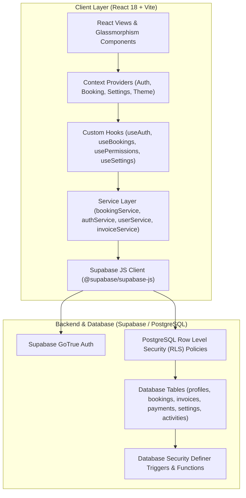

# Hotel ERP — Enterprise Hotel Management System

A modern, full-featured Hotel Management ERP built with **React 18**, **Vite**, **Tailwind CSS**, and **Supabase (PostgreSQL & Row Level Security)**. Designed for luxury hotels, resorts, and boutique hospitality properties to streamline front-desk operations, room bookings, guest billing, financial reporting, and multi-role staff administration.

---

## 🌟 Key Features

### 1. 🔐 Authentication & Role-Based Access Control (RBAC)
- **Supabase Authentication**: Secure session management and persistent staff authentication.
- **Hierarchical Roles**: Pre-configured permission matrices for **Super Admin**, **Manager**, **Receptionist**, and **Accountant**.
- **Granular Permissions**: Restrict access to module actions (e.g., booking management, revenue analytics, staff administration, system settings).
- **Anti-Privilege Escalation**: Database triggers prevent unauthorized self-role elevation or accidental deletion of the last Super Admin.

### 2. 📊 Executive Dashboard & Real-Time Analytics
- **Live KPI Metrics**: Total bookings, active check-ins, occupancy rate, daily/monthly revenue, and pending balances.
- **Visual Analytics**: Interactive charts (Recharts) for monthly booking trends, room type occupancy distribution, and revenue breakdown.
- **Quick Action Center**: One-click shortcuts for adding bookings, generating invoices, viewing reports, and managing settings.
- **Upcoming Widget**: Quick overview of upcoming arrivals and pending departures.

### 3. 🛎️ Comprehensive Booking Management
- **Lifecycle Tracking**: Full state management across `Confirmed`, `Checked In`, `Checked Out`, and `Cancelled`.
- **Room Type Management**: Standard Room, Deluxe Suite, Executive Suite, Family Suite, and Presidential Suite with dynamic pricing and capacity handling.
- **Dedicated Sub-Views**: Quick-filtered views for Upcoming, Completed, and Cancelled bookings.
- **Customer & ID Proofs**: Verification tracking supporting Aadhar Card, Passport, Driving License, Voter ID, and National ID.

### 4. 💳 Multi-Mode Payment & Billing Engine
- **Flexible Payments**: Support for Cash, Credit/Debit Cards, UPI / Online, and Net Banking.
- **Status Tracking**: Automated calculation for `Paid`, `Partial`, and `Pending` payment balances.
- **Dynamic GST & Tax Calculation**: Configurable CGST + SGST tax engine calculated on net room rates.

### 5. 📄 Professional Invoice Generation
- **Automated Invoicing**: Real-time invoice rendering with unique serial prefixes (e.g., `INV-GS-XXXX`).
- **Export Capabilities**: Clean print stylesheet and one-click PDF generation powered by `html2canvas` and `jsPDF`.
- **Itemized Breakdown**: Transparent display of room charges, stay duration, tax breakdown, amount paid, and balance due.

### 6. 📈 Reports & Data Export
- **Custom Date & Status Filters**: Filter operational and financial data by date range, payment status, and booking status.
- **Multi-Format Export**: Instant export to CSV, JSON data dumps, or printer-friendly layouts.

### 7. ⚙️ System Settings & Hotel Profile Configuration
- **Property Branding**: Customizable hotel name, address, contact details, GSTIN, and currency symbol.
- **Tax Rules**: Configurable default tax rates and invoice prefixes.
- **Theme Modes**: Modern Glassmorphism UI with Dark and Light mode toggles.

### 8. 🛡️ System Activity & Audit Trail
- **Action Logging**: Centralized activity log tracking staff actions (booking creations, check-ins, status updates, cancellations).

---

## 🛠️ Tech Stack

| Layer | Technology |
| :--- | :--- |
| **Frontend Framework** | [React 18](https://react.dev/) |
| **Build Tool & Bundler** | [Vite 5](https://vitejs.dev/) |
| **Styling & Design System** | [Tailwind CSS 3](https://tailwindcss.com/) & Glassmorphism |
| **Icons** | [Lucide React](https://lucide.dev/) |
| **Form Handling & Validation** | [React Hook Form](https://react-hook-form.com/) & [Zod](https://zod.dev/) |
| **Data Visualization** | [Recharts](https://recharts.org/) |
| **PDF & Print Generation** | [jsPDF](https://github.com/parallax/jsPDF) & [html2canvas](https://html2canvas.hertzen.com/) |
| **Notifications** | [React Hot Toast](https://react-hot-toast.com/) |
| **Database & Auth** | [Supabase](https://supabase.com/) (PostgreSQL 15) |
| **Security Layer** | PostgreSQL Row Level Security (RLS) & Security Definer Functions |

---

## 🏗️ Architecture



---

## 📁 Project Structure

```
hotel-management-erp/
├── .env.example              # Template for environment configuration
├── .gitignore                # Production git ignore rules
├── README.md                 # Project documentation
├── index.html                # Vite entry HTML
├── package.json              # Project dependencies and build scripts
├── postcss.config.js         # PostCSS configuration
├── tailwind.config.js        # Tailwind CSS theme and palette configuration
├── vite.config.js            # Vite build configuration & path aliases
├── supabase/
│   └── migrations/           # PostgreSQL schema migrations, RLS policies, & triggers
│       ├── 20260817_phase6_roles_permissions_security.sql
│       └── 20260817_phase7_fix_delete_rls_and_services.sql
└── src/
    ├── App.jsx               # Application root & provider setup
    ├── main.jsx              # Application DOM entrypoint
    ├── index.css             # Tailwind base styles, glassmorphism & print utilities
    ├── components/
    │   ├── activity/         # Activity logs table and action badges
    │   ├── analytics/        # Booking trends, occupancy, and revenue metric cards
    │   ├── booking/          # Booking form, tables, filters, and modal dialogs
    │   ├── common/           # Reusable UI components (Button, Card, Input, Modal, Table, etc.)
    │   ├── dashboard/        # Dashboard summary cards, revenue/status charts, quick actions
    │   ├── layout/           # DashboardLayout, Navbar, Sidebar, GlobalSearchModal
    │   ├── reports/          # Report filters, summary cards, and export tables
    │   ├── settings/         # General, tax, and system configuration forms
    │   └── users/            # Staff user tables, permissions badges, and modal dialogs
    ├── context/              # React Contexts (AuthContext, BookingContext, SettingsContext, ThemeContext)
    ├── hooks/                # Custom React Hooks (useAuth, useBookings, usePermissions, etc.)
    ├── lib/                  # Library configurations (Supabase client initialization)
    ├── pages/                # Page route components (Dashboard, Bookings, Analytics, Reports, Settings, etc.)
    ├── routes/               # AppRoutes & PrivateRoute role guards
    ├── services/             # API & Supabase data abstraction services
    └── utils/                # Constants, validation schemas, formatters, and invoice generator
```

---

## 🚀 Getting Started

### Prerequisites
- **Node.js**: `v18.0.0` or higher
- **npm**: `v9.0.0` or higher
- A **Supabase** account and project

---

### Environment Setup

1. Clone the repository to your local machine:
   ```bash
   git clone https://github.com/raj-saini001/hotel-management-erp.git
   cd hotel-management-erp
   ```

2. Create a local environment file from `.env.example`:
   ```bash
   cp .env.example .env.local
   ```

3. Open `.env.local` and configure your Supabase credentials:
   ```env
   VITE_SUPABASE_URL=https://your-project-id.supabase.co
   VITE_SUPABASE_ANON_KEY=your_supabase_anon_key
   VITE_SUPABASE_PUBLISHABLE_KEY=your_supabase_publishable_key
   ```

> [!NOTE]
> Only public client-side keys (`anon` / `publishable`) are used by the React frontend. Never add `service_role` or database password keys to frontend environment variables.

---

### Database Setup

Run the SQL migration scripts located in the `supabase/migrations/` directory against your Supabase PostgreSQL database via the Supabase SQL Editor:
1. `supabase/migrations/20260817_phase6_roles_permissions_security.sql`
2. `supabase/migrations/20260817_phase7_fix_delete_rls_and_services.sql`

---

### Installation

Install the required dependencies:
```bash
npm install
```

---

### Development Server

Start the local Vite development server:
```bash
npm run dev
```
The application will be accessible at `http://localhost:3000`.

---

### Production Build

Create an optimized production build:
```bash
npm run build
```

Preview the production build locally:
```bash
npm run preview
```

---

## 🔒 Security & Privacy

- **Row Level Security (RLS)**: Enforced on all Supabase tables (`profiles`, `bookings`, `invoices`, `payments`, `settings`, `activities`).
- **RBAC Guards**: Protected frontend routes dynamically verify authentication and module-level permissions before rendering.
- **Client Security**: No secret keys, database credentials, or `service_role` keys are included in the frontend codebase.
- **Zero Real Customer Data**: Repository mock data and fixtures contain only sanitized, synthetic placeholder data.

---

## 📄 License

This project is licensed under the [MIT License](LICENSE) — see the LICENSE file for details.
